# 🎮 Gammy – Universal Game Backend Server

**Gammy** is a powerful and flexible universal backend server built with **Micronaut** and **Java 21**, designed to accelerate game development. It provides robust, ready-to-use features such as authentication, game statistics tracking, achievements, leaderboards, player reporting, and interaction tracking — empowering you to focus on crafting compelling game experiences.

---

## 📸 Screenshots

| Main Page                              |
|----------------------------------------|
| 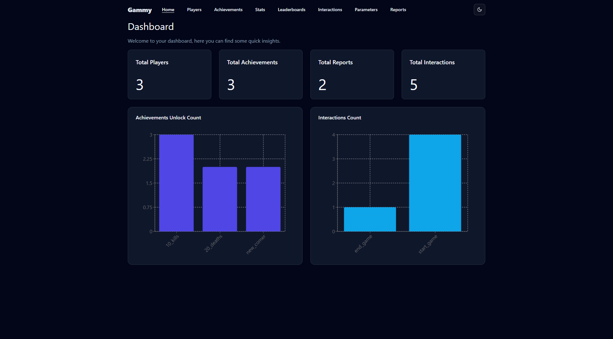 |

| Players                             | Achievements                                  | Leaderboards                                  |
|-------------------------------------|-----------------------------------------------|-----------------------------------------------|
| 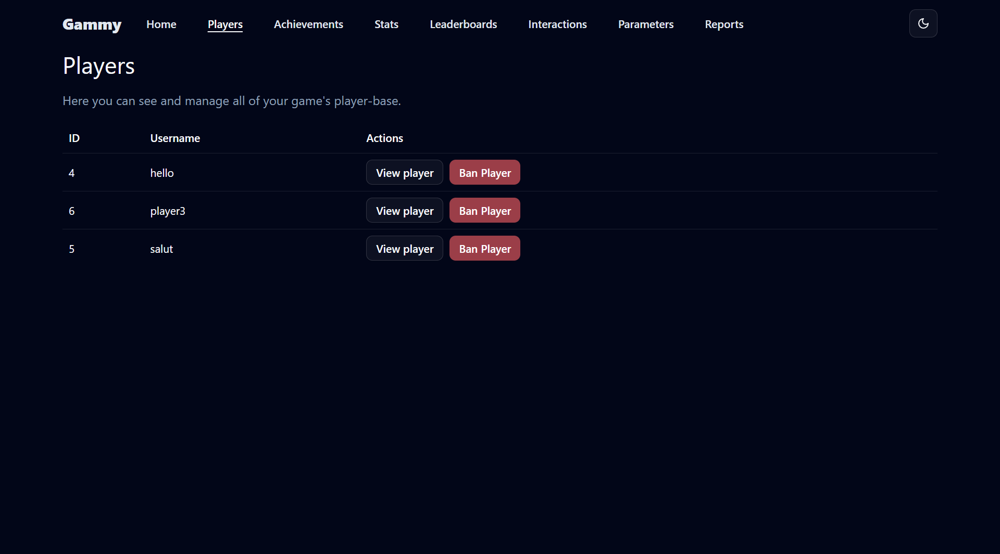 | 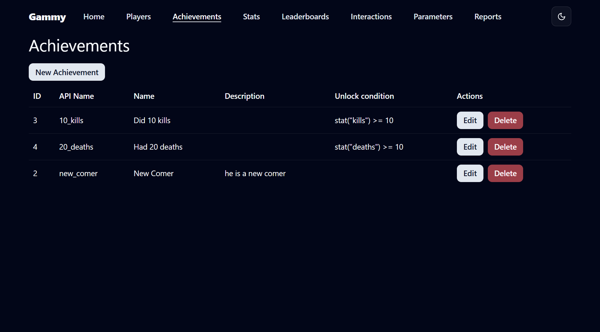 | 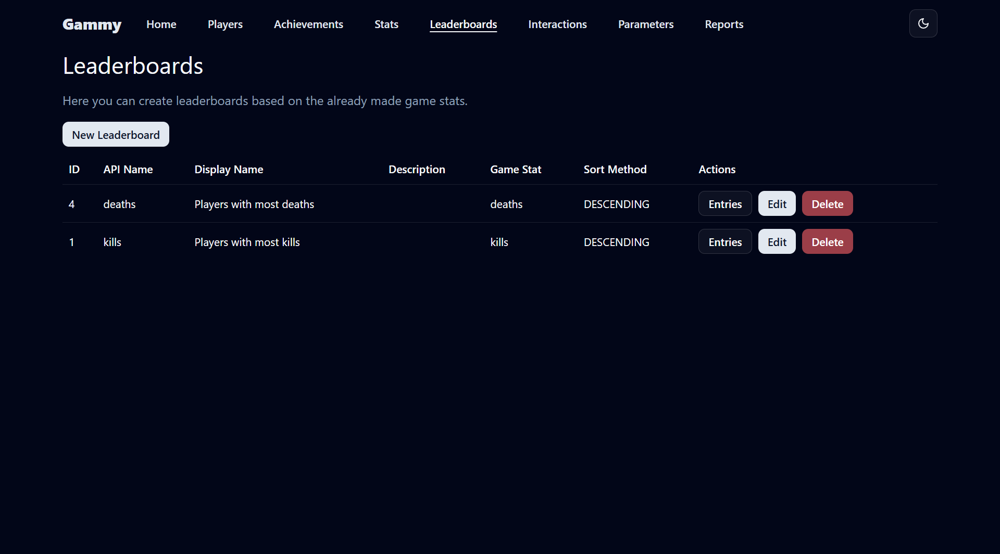 |

| Player Stats                                  | Interactions                                  | Reports                                   |
|-----------------------------------------------|-----------------------------------------------|-------------------------------------------|
| 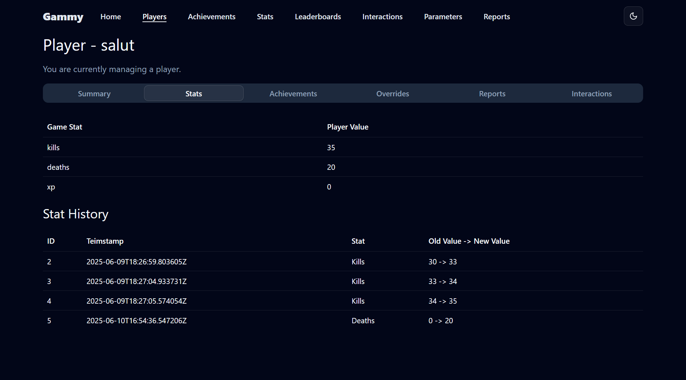 | 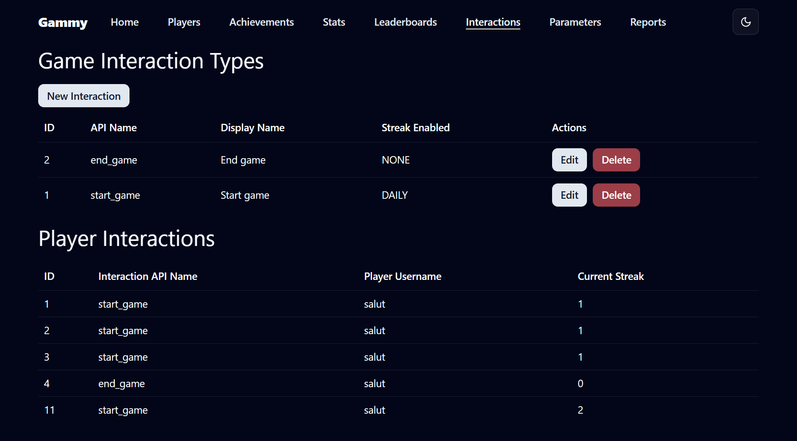 | 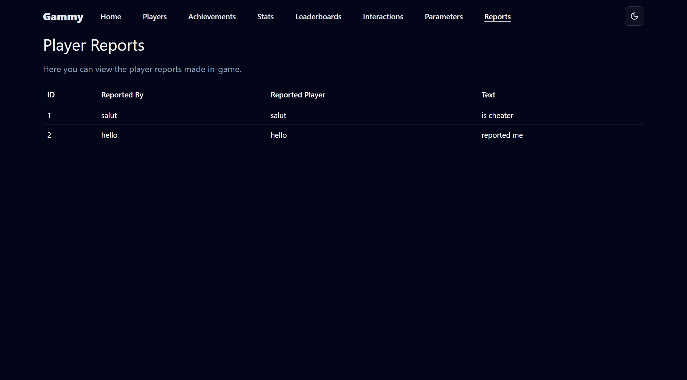 |

| Parameters                                    | Computed Parameters                                     | Analytics                                    |
|-----------------------------------------------|---------------------------------------------------------|----------------------------------------------|
| 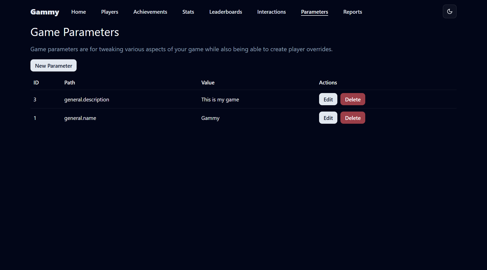 | 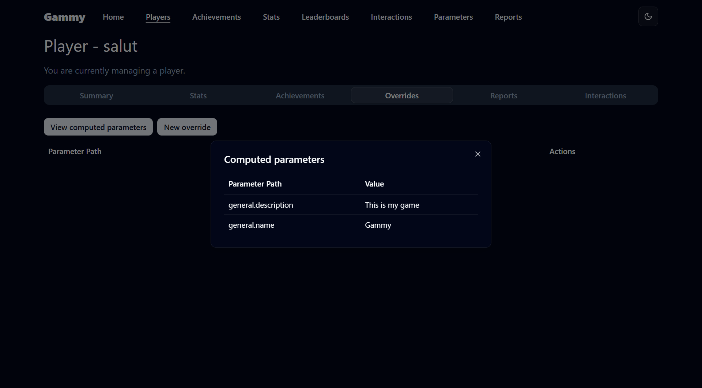 | 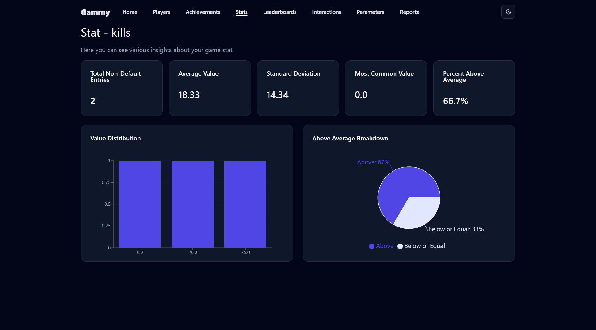 |

| Player Interactions                                         | Specific Reports                                             |
|-------------------------------------------------------------|--------------------------------------------------------------|
| 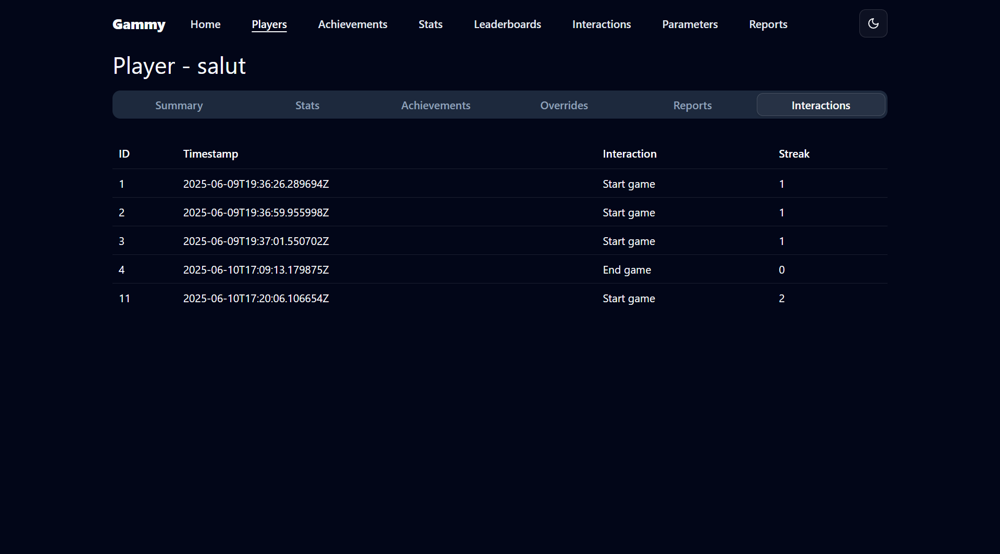 | 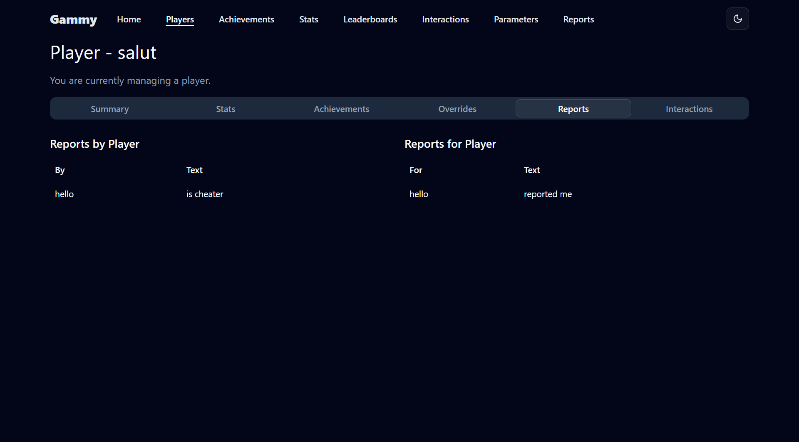 |

---

## 🔐 Authentication & Authorization

- **Player and Admin Authentication**  
  Securely authenticate both regular players and administrative users.

- **Player Profile Creation**  
  Easily create and manage player accounts and profiles.

- **Permission Validation**  
  Validate user permissions against in-game objects and specific actions.

---

## 📊 Game Statistics

- **Customizable Game Stats**  
  Define custom stats like `kills`, `gold_collected`, `time_played`, etc., with type safety and metadata.

- **Flexible Stat Updates**  
  Update statistics through various methods — direct set, increment, etc.

- **Stat Validation Rules**
  - Enforce `min` / `max` values
  - Limit `maximum change` per update
  - Support `increment-only` values

- **Score Change History**  
  Automatically track a detailed history of all stat changes for auditing or analytics.

---

## 🏆 Achievements

- **Create & Manage Achievements**  
  Define achievements like "First Blood" or "Marathon Runner" using custom logic.

- **Manual Unlock/Lock**  
  Admins can manually unlock or lock achievements per player.

- **Dynamic Condition-Based Unlocking**  
  Unlock achievements automatically based on stat conditions.

---

## 🥇 Leaderboards

- **Dynamic Leaderboard Generation**  
  Create leaderboards based on existing statistics (e.g., highest kills, longest session time).

- **Order Configuration**  
  Configure boards to sort ascending or descending.

---

## 🚨 Player Reporting

- **In-Game Reporting**  
  Allow players to report others with reason codes or descriptions.

- **Report Management**
  - View reports filed *against* a player
  - View reports *submitted by* a player

---

## 📈 Interaction Tracking

- **Track Custom Interactions**  
  Log any type of interaction like level completion, shop visits, or PVP engagement.

- **Daily Streak Monitoring**  
  Automatically track and reward daily streaks per user interaction.
