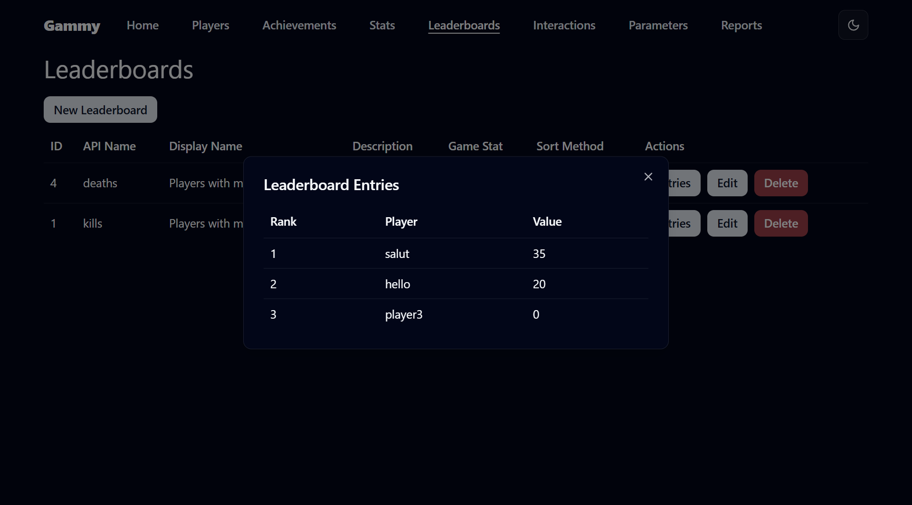
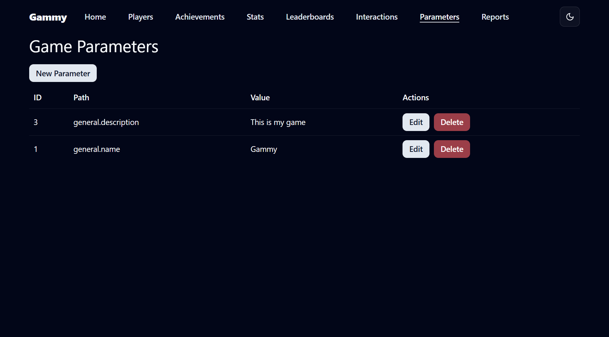
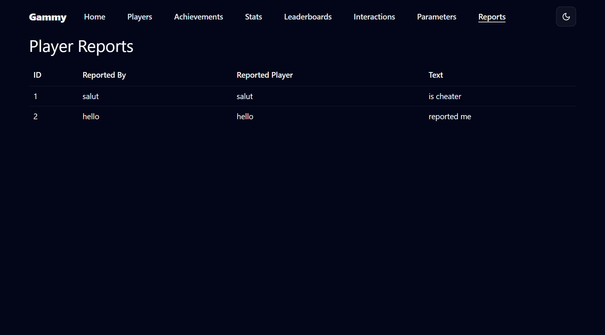
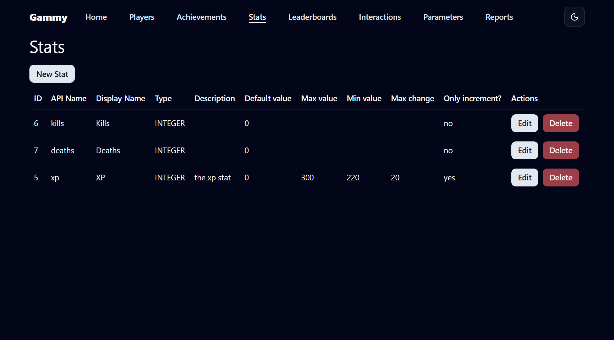

# 🎮 Gammy – Server Universal de Backend pentru Jocuri

**Gammy** este un server backend universal, puternic și flexibil, construit cu **Micronaut** și **Java 21**, conceput pentru a accelera dezvoltarea jocurilor. Oferă funcționalități robuste, gata de utilizare, precum autentificare, urmărirea statisticilor jocului, realizări, clasamente, raportarea jucătorilor și urmărirea interacțiunilor — permițându-ți să te concentrezi pe crearea unor experiențe captivante de joc.

---

## 📸 Capturi de ecran

| Jucători | Realizări | Clasamente |
|----------|-----------|------------|
|  |  |  |

| Intrări Clasament | Parametri | Rapoarte |
|-------------------|-----------|----------|
|  |  |  |

| Statistici | Interacțiuni |
|------------|--------------|
|  |  |

---

## 🔐 Autentificare și Autorizare

- **Autentificare Jucători și Admini**  
  Autentificare sigură pentru utilizatori obișnuiți și administratori.

- **Crearea Profilului de Jucător**  
  Creează și gestionează cu ușurință conturile și profilurile jucătorilor.

- **Validarea Permisiunilor**  
  Verifică permisiunile utilizatorilor pentru obiecte sau acțiuni specifice din joc.

---

## 📊 Statistici de Joc

- **Statistici Personalizabile**  
  Definește statistici precum `kills`, `gold_collected`, `time_played`, etc., cu validare și metadate.

- **Actualizări Flexibile**  
  Actualizează statisticile prin metode diverse — setare directă, incrementare, etc.

- **Reguli de Validare**
  - Impune valori `min` / `max`
  - Limitează `schimbarea maximă` per actualizare
  - Suportă valori `doar incrementale`

- **Istoric Schimbări Scor**  
  Urmărește automat istoricul complet al modificărilor pentru audit sau analiză.

---

## 🏆 Realizări

- **Creare și Gestionare Realizări**  
  Definește realizări precum „Prima Victimă” sau „Alergător de Maraton” cu logică personalizată.

- **Deblocare/Blocare Manuală**  
  Administratorii pot debloca sau bloca manual realizările pentru un jucător.

- **Deblocare Dinamică pe Bază de Condiții**  
  Realizările pot fi deblocate automat în funcție de condițiile statisticilor.

---

## 🥇 Clasamente

- **Generare Dinamică Clasamente**  
  Creează clasamente pe baza statisticilor existente (ex: cei mai mulți kills, cel mai lung timp de joc).

- **Configurare Ordine**  
  Configurează afișarea în ordine crescătoare sau descrescătoare.

---

## 🚨 Raportarea Jucătorilor

- **Raportare În Joc**  
  Permite jucătorilor să raporteze alți utilizatori direct din joc.

- **Gestionare Rapoarte**
  - Vizualizează rapoartele primite *despre* un jucător
  - Vizualizează rapoartele *trimise de* un jucător

---

## 📈 Urmărirea Interacțiunilor

- **Urmărire Interacțiuni Personalizate**  
  Înregistrează orice tip de interacțiune: finalizarea unui nivel, vizite în magazin, lupte PVP etc.

- **Monitorizare Serii Zilnice**  
  Urmărește automat și recompensează serii zilnice de acțiuni per utilizator.

