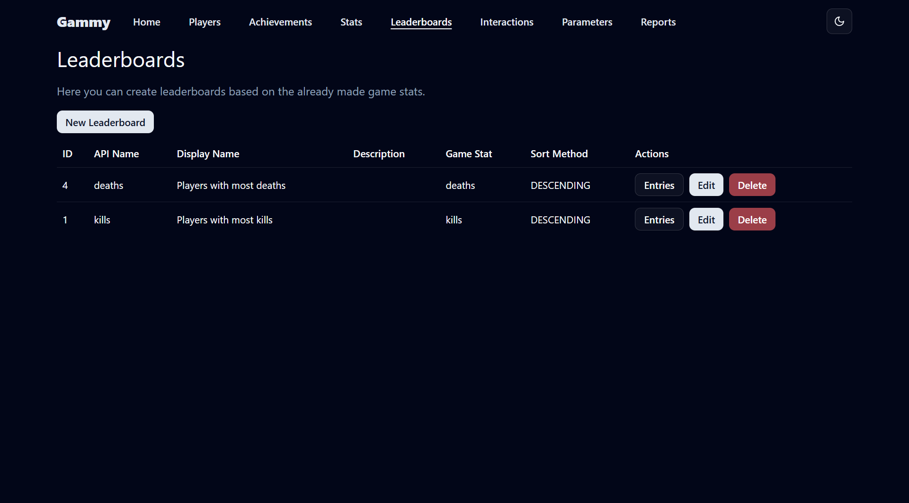
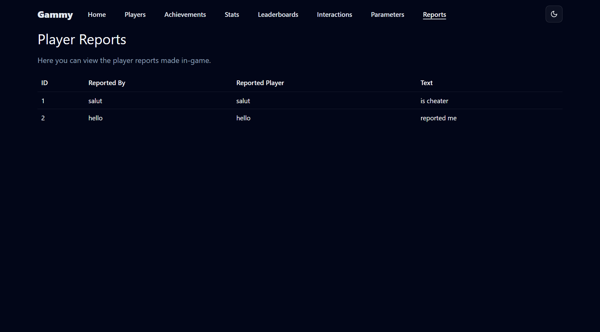
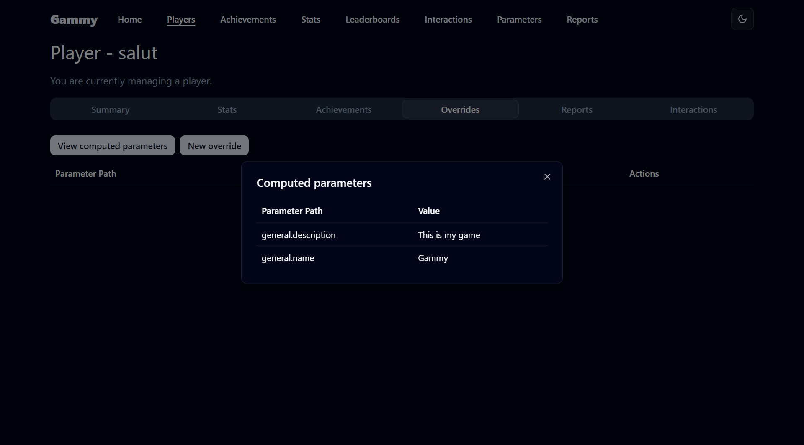
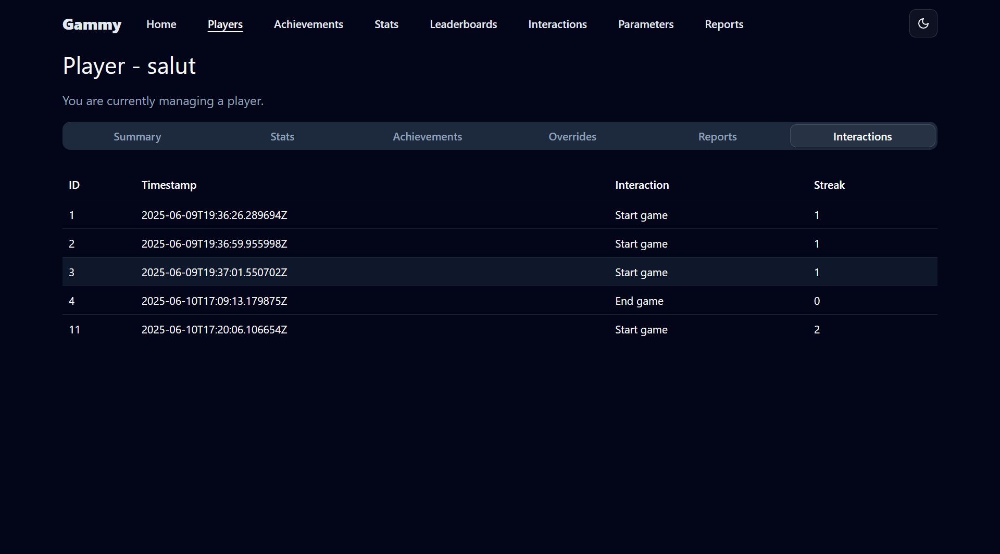
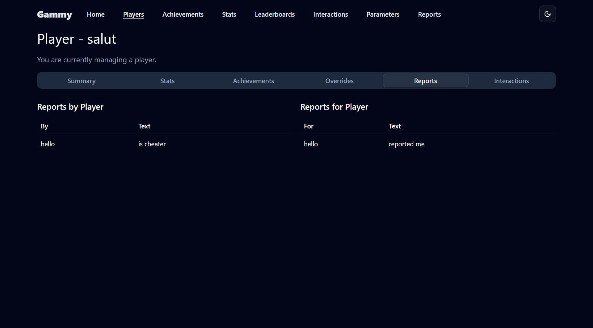

# 🎮 Gammy – Server Universal de Backend pentru Jocuri

**Gammy** este un server backend universal, puternic și flexibil, construit cu **Micronaut** și **Java 21**, conceput pentru a accelera dezvoltarea jocurilor. Oferă funcționalități robuste, gata de utilizare, precum autentificare, urmărire statistici, realizări, clasamente, raportare jucători și urmărirea interacțiunilor — astfel încât tu să te poți concentra pe crearea unor experiențe de joc captivante.

---

## 📸 Capturi de ecran

| Pagina Principală                              |
|------------------------------------------------|
|  |

| Jucători                             | Realizări                                  | Clasamente                                  |
|--------------------------------------|--------------------------------------------|---------------------------------------------|
|  |  |  |

| Statistici Jucător                                  | Interacțiuni                                  | Rapoarte                                   |
|-----------------------------------------------------|-----------------------------------------------|--------------------------------------------|
|  |  |  |

| Parametri                                    | Parametri Calculați                                      | Analize Statistice                         |
|----------------------------------------------|----------------------------------------------------------|--------------------------------------------|
|  |  |  |

| Interacțiuni Jucător                                         | Rapoarte Specifice                                             |
|--------------------------------------------------------------|----------------------------------------------------------------|
|  |  |

---

## 🔐 Autentificare și Autorizare

- **Autentificare Jucători și Admini**  
  Autentificare securizată atât pentru jucători obișnuiți cât și pentru utilizatori administrativi.

- **Creare Profil Jucător**  
  Creează și gestionează ușor conturile și profilurile jucătorilor.

- **Validare Permisiuni**  
  Verifică permisiunile utilizatorilor în raport cu obiectele din joc și acțiunile permise.

---

## 📊 Statistici de Joc

- **Statistici Personalizabile**  
  Definește statistici precum `uciderei`, `aur_colectat`, `timp_jucat`, etc., cu tipuri sigure și metadate.

- **Actualizări Flexibile**  
  Actualizează statisticile prin metode variate — setare directă, incrementare etc.

- **Reguli de Validare**
  - Limite `min` / `max`
  - Schimbare maximă admisă per actualizare
  - Valori doar cu incrementare

- **Istoric al Schimbărilor**  
  Păstrează automat istoricul complet al modificărilor pentru audit sau analiză.

---

## 🏆 Realizări

- **Creare și Gestionare Realizări**  
  Definește realizări precum „Prima Victimă” sau „Maratonist” folosind logică personalizată.

- **Deblocare/Blocare Manuală**  
  Adminii pot debloca sau bloca realizări manual, per jucător.

- **Deblocare Dinamică**  
  Realizările pot fi deblocate automat în funcție de condițiile pe statistici.

---

## 🥇 Clasamente

- **Generare Dinamică**  
  Creează clasamente pe baza statisticilor existente (ex: cei mai mulți inamici uciși).

- **Configurare Ordine**  
  Configurează sortarea ascendentă sau descendentă a clasamentelor.

---

## 🚨 Raportare Jucători

- **Raportare în Joc**  
  Permite jucătorilor să raporteze alți jucători folosind coduri de motiv sau descrieri.

- **Gestionare Rapoarte**
  - Vezi rapoartele *împotriva* unui jucător
  - Vezi rapoartele *trimise de* un jucător

---

## 📈 Urmărirea Interacțiunilor

- **Urmărire Interacțiuni Personalizate**  
  Înregistrează orice tip de interacțiune — finalizare nivel, vizite în magazin, lupte PVP etc.

- **Monitorizare Serii Zilnice**  
  Urmărește automat și recompensează serii de interacțiuni zilnice ale utilizatorilor.
